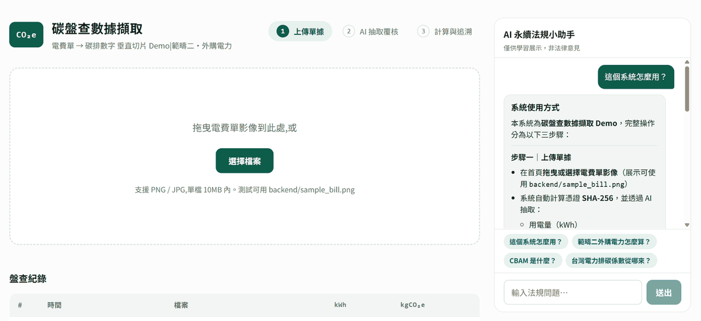
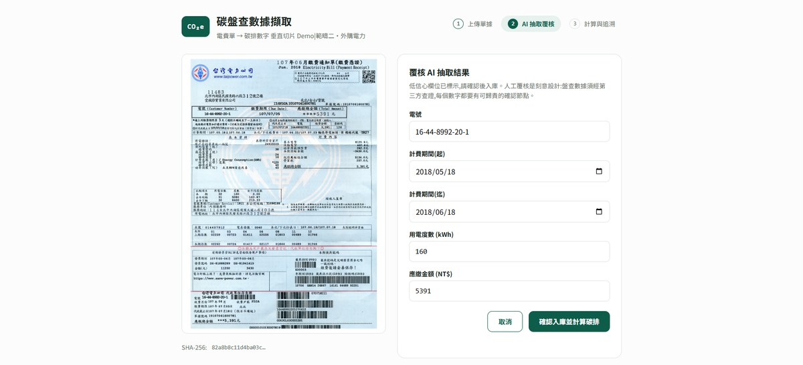
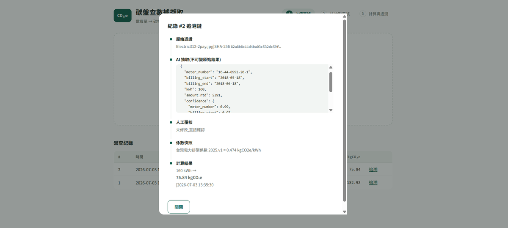

# 碳盤查數據擷取 Demo — 電費單 → 碳排數字

企業永續管理平台「碳盤查模組」的垂直切片示範：

1. **主流程：** 上傳電費單 → AI 抽取 → 人工覆核 → 係數計算 → 可追溯紀錄
2. **法規問答：** AI 永續法規小助手（TF-IDF 檢索 + Claude 生成，附官方來源）

本專案聚焦 **GHG Protocol 範疇二（外購電力）** 這條最窄但完整的路徑，展示從原始憑證到可查證碳排數字的端到端流程；並以輕量 RAG 補足「法規解釋」情境。

**技術棧：** React (Vite) · FastAPI · SQLite · scikit-learn (TF-IDF) · Claude Vision / Text (Anthropic API)

---

## 目錄

- [GHG Protocol 範疇二（外購電力）](#ghg-protocol-範疇二外購電力)
- [系統架構](#系統架構)
- [專案結構](#專案結構)
- [資料流與 API](#資料流與-api)
- [RAG 永續法規問答](#rag-永續法規問答)
- [資料庫設計](#資料庫設計)
- [核心設計決策](#核心設計決策)
- [環境需求與啟動](#環境需求與啟動)
- [操作說明（Demo 動線）](#操作說明demo-動線)
- [介面預覽](#介面預覽)
- [DEMO_MODE 備援機制](#demo_mode-備援機制)
- [本 Demo 範圍外](#本-demo-範圍外)

---

## GHG Protocol 範疇二（外購電力）

**GHG Protocol**（溫室氣體議定書）是國際通用的溫室氣體盤查標準。排放依來源分為三大範疇：

| 範疇 | 名稱 | 說明 | 常見例子 |
|------|------|------|----------|
| 範疇一 | 直接排放 | 公司現場燃燒產生的排放 | 鍋爐、公務車汽油 |
| **範疇二** | **外購能源的間接排放** | **向外部購買的電、熱、蒸氣在產製端的排放** | **向台電買電** |
| 範疇三 | 價值鏈間接排放 | 上下游、差旅、廢棄物等 | 供應商製造、員工通勤 |

**範疇二（外購電力）** 指企業使用的電力並非自行發電，而是由電廠產生；雖然煙囪不在公司現場，但用電行為仍驅動發電端排放，因此須納入盤查。對多數企業而言，外購電力是範疇二最大、也最好量化的項目。

**計算方式：**

```
碳排放量 = 用電量 (kWh) × 排放係數 (kgCO₂e/kWh)
```

- **活動數據**：電費單、智慧電表等來源的用電度數
- **排放係數**：依電網公告，例如台灣電力排碳係數（能源署每年更新）

本 Demo 採用**位置基準（Location-based）**——以當地電網平均係數計算，並在入庫時快照係數版本，確保歷史紀錄可對應查證當時所用的係數。完整產品另可支援**市場基準（Market-based）**（綠電憑證、PPA 等合約），本垂直切片刻意不包含。

---

## 系統架構

```
┌──────────────────────────────────────────────────────────────────────────┐
│  Frontend  React + Vite  (localhost:5173)                                  │
│  ┌────────────────────────────────────────────┐  ┌──────────────────┐  │
│  │ 主流程                                      │  │ AI 永續法規小助手 │  │
│  │ 1.上傳 → 2.覆核 → 3.結果 → 追溯鏈 Modal    │  │ 範例問題 / 對話  │  │
│  └────────────────────────────────────────────┘  │ 來源 Badge 連結  │  │
│  （窄螢幕：助手預設收合，右下角 FAB 展開）         └──────────────────┘  │
└────────────────────────────┬─────────────────────────────────────────────┘
                             │ /api/* (Vite dev proxy)
                             ▼
┌──────────────────────────────────────────────────────────────────────────┐
│  Backend  FastAPI  (localhost:8000)                                      │
│                                                                          │
│  POST /api/extract      影像 → SHA-256 → Claude Vision → 結構化欄位       │
│  POST /api/records      覆核值入庫 → 係數快照 → 碳排計算                  │
│  POST /api/chat/rag     提問 → TF-IDF 檢索知識庫 → Claude Text 回答       │
│  GET  /api/records      盤查紀錄列表                                      │
│  GET  /api/records/{id} 單筆完整追溯鏈                                    │
│  GET  /api/factors      版本化排放係數庫                                  │
│  GET  /api/health       健康檢查（demo_mode、rag_kb_count）               │
│                                                                          │
│  SQLite (carbon.db)  +  uploads/  +  knowledge_base.py（硬編碼法規摘要）  │
└──────────────────────────────────────────────────────────────────────────┘
```

**三階段使用者流程：**

| 步驟 | 畫面 | 後端動作 |
|------|------|----------|
| 1. 上傳單據 | 拖曳或選擇電費單影像 | 計算 SHA-256、儲存憑證、呼叫 Vision API 抽取欄位 |
| 2. AI 抽取覆核 | 預填欄位，低信心（< 0.8）琥珀色高亮 | 回傳抽取結果與合理性警告，等待人工確認 |
| 3. 計算與追溯 | 顯示 tCO₂e、係數版本、稽核軌跡 | 入庫、快照係數、計算碳排，可展開完整追溯鏈 |

---

## 專案結構

```
carbon-demo/
├── frontend/
│   ├── src/
│   │   ├── App.jsx                  # 三步驟 UI、側欄版面、追溯鏈 Modal
│   │   ├── RegulationAssistant.jsx  # RAG 法規問答側欄
│   │   └── main.jsx
│   └── vite.config.js       # dev server 將 /api 代理至 :8000
├── backend/
│   ├── main.py              # FastAPI 主程式（抽取、入庫、RAG、追溯）
│   ├── knowledge_base.py    # RAG 知識庫摘要與 DEMO 預錄回答
│   ├── make_sample_bill.py  # 產生合成測試電費單（虛構資料）
│   ├── sample_bill.png      # 執行上述腳本後產生，供 Demo 使用
│   ├── requirements.txt
│   ├── pytest.ini
│   ├── tests/               # pytest（含 test_rag.py）
│   ├── .env.example         # ANTHROPIC_API_KEY 範本
│   ├── carbon.db            # SQLite（執行後自動建立，已 gitignore）
│   └── uploads/             # 上傳憑證儲存（已 gitignore）
├── docs/
│   └── images/              # README 介面截圖
└── README.md
```

---

## 資料流與 API

### `POST /api/extract`

上傳電費單影像，回傳 AI 抽取結果。

**輸入：** `multipart/form-data`，欄位 `file`（PNG / JPG / WebP，上限 10 MB）

**輸出重點：**

```json
{
  "file_name": "sample_bill.png",
  "file_sha256": "abc123...",
  "extraction": {
    "meter_number": "07-51-2088-13-6",
    "billing_start": "2026-04-01",
    "billing_end": "2026-05-31",
    "kwh": 42580,
    "amount_ntd": 128460,
    "confidence": { "kwh": 0.97, "amount_ntd": 0.64, "...": "..." }
  },
  "warnings": [],
  "mode": "demo",
  "duplicate_of": null
}
```

- `mode`：`live`（真實 API）/ `demo`（無 API Key）/ `fallback`（API 失敗備援）
- `duplicate_of`：若此憑證 SHA-256 已入庫，回傳既有紀錄摘要（`id`、`created_at`、`file_name`、`kwh`、`emission_kgco2e`）；否則為 `null`
- 抽取欄位：電號、計費期間起迄、用電度數、應繳金額，各附 0–1 信心分數

### `POST /api/records`

人工覆核確認後入庫並計算碳排。

**輸入：**

```json
{
  "file_name": "...",
  "file_sha256": "...",
  "extraction_raw": { "...AI 原始抽取..." },
  "confirmed": { "meter_number": "...", "billing_start": "...", "billing_end": "...", "kwh": 42580, "amount_ntd": 128460 }
}
```

**輸出重點：** 紀錄 ID、碳排量（kgCO₂e / tCO₂e）、使用的係數快照、被人工修改的欄位列表。

**計算公式：** `emission_kgco2e = kWh × 排放係數 (kgCO2e/kWh)`

係數依帳單 `billing_end` 的年份自動選用（例如 2024 年帳單 → `2024.v1`）。

**重複憑證防護：** 以 `file_sha256`（檔案內容指紋，與檔名無關）判斷是否已入庫。同一張單據影像不可重複盤查；若 SHA 已存在 → **`409 Conflict`**，訊息含既有紀錄編號。前端 Step 2 會提前顯示警告並停用「確認入庫」按鈕。

### `GET /api/records/{id}`

回傳單筆紀錄的完整追溯鏈：

1. 原始憑證（檔名 + SHA-256）
2. AI 抽取原始結果（不可變）
3. 人工覆核（哪些欄位被修改）
4. 係數快照（版本、數值、來源）
5. 最終計算結果

### `GET /api/factors`

回傳版本化排放係數庫（目前內建 2024.v1、2025.v1 台灣電力排碳係數）。

### `POST /api/chat/rag`

永續法規問答：以 TF-IDF 從知識庫檢索最相關段落，再交由 Claude 依參考資料生成回答。

**輸入：**

```json
{ "query": "範疇二外購電力怎麼算？" }
```

**輸出重點：**

```json
{
  "answer": "範疇二外購電力碳排計算方式：排放量 = 用電量（kWh）× 排放係數…",
  "source": "GHG Protocol Scope 2 指引",
  "source_url": "https://ghgprotocol.org/scope-2-guidance",
  "score": 0.23,
  "low_confidence": false,
  "mode": "demo"
}
```

| `mode` 值 | 說明 |
|-----------|------|
| `demo` | 未設定 API Key，回傳依主題預錄的回答 |
| `live` | 成功呼叫 Claude Text API |
| `fallback` | 有 API Key 但呼叫失敗，降級為預錄回答 |
| `no_match` | 檢索分數低於門檻，知識庫無相關段落 |

- 空字串或僅空白 → `422`
- 問題上限 500 字
- `score` 介於低信心門檻時，`low_confidence: true`（前端來源 Badge 琥珀色提示）

---

## RAG 永續法規問答

### 知識庫（4 筆官方摘要）

硬編碼於 [`backend/knowledge_base.py`](backend/knowledge_base.py)，每筆含 `source`、`source_url`、`content`：

| 主題 | 對應情境 |
|------|----------|
| GHG Protocol Scope 2 指引 | 範疇二外購電力、位置/市場基準 |
| 台灣環境部溫室氣體盤查指引 | 登錄時程、查證、電費單作為活動數據 |
| 經濟部能源署電力排碳係數公告 | 係數來源、年度版本、kgCO2e/kWh |
| 歐盟 CBAM 過渡期指南 v1 | 出口歐盟、內含碳排放申報 |

內容為**摘要**而非法規全文；UI 標示「僅供學習展示，非法律意見」。

### 檢索與生成流程

1. 使用者提問 → `TfidfVectorizer`（中文 char n-gram）計算與知識庫的 cosine 相似度
2. 取 top-1 段落作為 context；分數過低則 `no_match`，不呼叫 LLM
3. `DEMO_MODE` 或 API 失敗時，依命中主題回傳 `DEMO_RAG_ANSWERS` 預錄稿
4. 前端顯示回答與可點擊的 📄 來源 Badge（連至 `source_url`）

### 前端助手

- **寬螢幕（≥ 1100px）：** 右側固定側欄，與主流程並排
- **窄螢幕：** 預設收合；右下角「法規助手」FAB 展開底部抽屜
- 內建範例問題 chips；對話 state 在視窗縮放時保留（單一元件實例）
- Step 3 結果頁引導使用者開啟法規助手

### 建議測試問題

| 問題 | 預期 |
|------|------|
| 範疇二外購電力怎麼算？ | GHG Protocol Scope 2 |
| CBAM 是什麼？ | 歐盟 CBAM 指南 |
| 台灣電力排碳係數從哪來？ | 能源署係數公告 |
| 盤查報告幾月前要登錄？ | 環境部盤查指引 |
| 今天天氣如何？ | `no_match`，無來源 Badge |

---

## 資料庫設計

SQLite 單表 `records`，每筆盤查紀錄包含：

| 欄位 | 說明 |
|------|------|
| `file_sha256` | 原始憑證雜湊，確保檔案完整性可追溯 |
| `extraction_raw` | AI 原始抽取 JSON（入庫後不可變） |
| `confirmed_fields` | 人工覆核後的最終值 |
| `edited_fields` | 被修改的欄位名稱陣列（稽核軌跡） |
| `factor_snapshot` | 計算當下係數的完整快照（版本、數值、來源） |
| `kwh` / `emission_kgco2e` | 活動數據與計算結果 |

---

## 核心設計決策

### 1. 人工覆核是需求，不是妥協

盤查數據須經第三方查證，每個數字都需要可歸責的確認節點。AI 的價值在於**把覆核成本降到趨近於零**（預填 + 低信心欄位高亮），而非取消覆核。信心 < 0.8 的欄位以琥珀色標示。

### 2. 係數版本化 Snapshot

電力排碳係數每年由能源署公告。紀錄入庫時將當年度係數**完整快照**存入該筆紀錄；未來係數更新**不回溯**改動歷史數據，否則已查證的報告會對不上。

### 3. 稽核軌跡

AI 原始抽取結果不可變地保存；人工修改過哪些欄位、原始檔 SHA-256、係數版本、計算時間全部可追溯，一鍵展開完整證據鏈。

### 4. 入庫前防呆

抽取後、入庫前執行合理性檢查：用電度數範圍（0–10,000,000 kWh）、計費期間起迄邏輯。起日晚於迄日時拒絕入庫。

### 5. 憑證去重（SHA-256）

上傳時計算檔案 **SHA-256** 作為憑證指紋（與檔名無關，重新命名不影響）。入庫前比對是否已有相同 hash 的紀錄：**同一張單據不可重複計入盤查**。抽取階段即回傳 `duplicate_of` 供前端警告；後端 `POST /api/records` 以 `409` 硬性阻擋。上傳檔案仍以 hash 命名存於 `uploads/`，重複上傳不會多佔空間。

### 6. 輕量 RAG，答案附出處

法規問答採 **檢索增強生成（RAG）**：先以 TF-IDF 從小知識庫找出最相關摘要，再交由 Claude 生成回答，並回傳 `source` / `source_url` 供前端 Badge 顯示。Demo 階段不引入向量資料庫；無 API Key 時依主題回傳預錄稿，確保展示穩定。

---

## 環境需求與啟動

### 環境需求

- Python 3.10+
- Node.js 18+
- （選用）Anthropic API Key — 用於真實 Claude Vision 抽取與 RAG 法規問答

### 後端

```bash
cd backend
pip install -r requirements.txt
python make_sample_bill.py            # 產生合成測試電費單 sample_bill.png

# 選用：設定 API Key 以啟用真實抽取
cp .env.example .env
# 編輯 .env，填入 ANTHROPIC_API_KEY=sk-ant-...

uvicorn main:app --port 8000
```

後端啟動後可訪問 `http://localhost:8000/docs` 查看 Swagger API 文件。

### 前端

```bash
cd frontend
npm install
npm run dev    # http://localhost:5173
```

前端透過 Vite proxy 將 `/api` 請求轉發至 `http://localhost:8000`，**兩個服務需同時運行**。

### 健康檢查

```bash
curl http://localhost:8000/api/health
# {"status":"ok","demo_mode":true,"rag_kb_count":4}
```

`demo_mode: true` 表示未設定 API Key，抽取與 RAG 端點使用預錄結果。`rag_kb_count` 為知識庫段落數。

### 執行測試

```bash
cd backend
pip install -r requirements.txt
pytest
```

測試涵蓋：`validate()` / `pick_factor()` / `retrieve_context()` 單元測試，以及 API 端點整合測試（含 RAG、憑證去重 `409`；使用隔離的暫存 DB，不影響開發資料）。

### 開發用：查詢或刪除測試紀錄

Windows 預設可能沒有 `sqlite3` CLI，可用 Python（在 `backend` 目錄）：

```bash
# 列出紀錄
python -c "import sqlite3; [print(r) for r in sqlite3.connect('carbon.db').execute('SELECT id, file_name, kwh FROM records')]"

# 刪除指定編號（例：id=3）
python -c "import sqlite3; c=sqlite3.connect('carbon.db'); c.execute('DELETE FROM records WHERE id=?', (3,)); c.commit()"
```

---

## 操作說明（Demo 動線）

建議使用 `backend/sample_bill.png` 進行現場展示（合成虛構資料，不含真實帳單或個資）。

### 約 2 分鐘展示腳本

1. **上傳** — 拖入 `sample_bill.png`，畫面顯示「AI 正在解析單據欄位…」
2. **覆核** — 指出「應繳金額信心 64%，系統自動高亮」→ 現場修改金額 → 說明「人工覆核是刻意設計，盤查數據要過第三方查證」
3. **入庫** — 點「確認入庫並計算碳排」→ 結果卡顯示 tCO₂e、係數版本與來源
4. **追溯** — 點「檢視追溯鏈」→ 展示：憑證 hash → AI 抽取 → 人工修改紀錄 → 係數快照 → 計算結果
5. **法規問答** — 右側「AI 永續法規小助手」點「範疇二外購電力怎麼算？」→ 展示回答與可點擊來源 Badge
6. **收尾** — 「主流程處理單據數字，法規助手解釋盤查規定；兩條路徑可擴展到範疇一、三與正式向量知識庫。」

### UI 操作要點

| 操作 | 位置 |
|------|------|
| 上傳單據 | 首頁拖曳區或「選擇檔案」按鈕 |
| 覆核修改 | Step 2 表單，低信心欄位有琥珀色提示 |
| 重複單據 | Step 2 琥珀色警告「此憑證已入庫」，可點「查看已入庫紀錄」；入庫按鈕停用 |
| 確認入庫 | Step 2 底部「確認入庫並計算碳排」（非重複憑證時） |
| 查看追溯鏈 | Step 3「檢視追溯鏈」，或下方盤查紀錄表格的「追溯」連結 |
| 法規問答 | 右側「AI 永續法規小助手」；窄螢幕點右下角「法規助手」 |
| 處理下一張 | Step 3「處理下一張單據」重置流程 |

---

## 介面預覽

### Step 1 — 上傳單據

拖曳或選擇電費單影像；下方盤查紀錄表可查看歷史入庫結果。



### Step 2 — AI 抽取覆核

左側顯示原始憑證與 SHA-256；右側為 AI 預填欄位，低信心欄位琥珀色高亮，供人工確認後入庫。若憑證已入庫會顯示重複警告。



### 追溯鏈

一鍵展開完整證據鏈：原始憑證 hash → AI 抽取（不可變）→ 人工覆核 → 係數快照 → 計算結果。



---

## DEMO_MODE 備援機制

未設定 `ANTHROPIC_API_KEY`，或 API 呼叫失敗時，相關端點使用預錄結果，確保線上 Demo 穩定運行。

### 電費單抽取（`/api/extract`）

回傳與 `sample_bill.png` 內容一致的預錄抽取結果。

| `mode` 值 | 觸發條件 |
|-----------|----------|
| `live` | 成功呼叫 Claude Vision API |
| `demo` | 未設定 `ANTHROPIC_API_KEY` |
| `fallback` | 有 API Key 但 Vision 呼叫失敗 |

前端覆核畫面在 non-live 模式下會顯示「預錄模式」標籤。

### 法規問答（`/api/chat/rag`）

依 TF-IDF 命中的知識庫主題，回傳對應的 `DEMO_RAG_ANSWERS` 預錄稿（仍附 `source` / `source_url`）。檢索無匹配時回傳 `mode: "no_match"`。

---

## 本 Demo 範圍外

以下功能在完整產品架構中規劃，但本垂直切片刻意不包含，以聚焦核心路徑：

- 登入與權限管理
- 範疇一（直接排放）/ 範疇三（價值鏈排放）
- 供應商填報入口
- 查證證據包匯出
- 報表輸出與儀表板
- embedding 向量庫、PDF 法規上傳、多輪對話脈絡

---

> 所有測試資料皆為合成虛構，不含任何真實帳單或個資。
